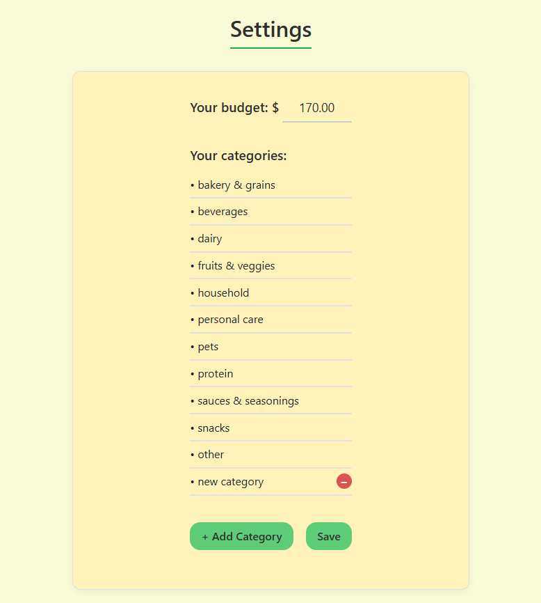
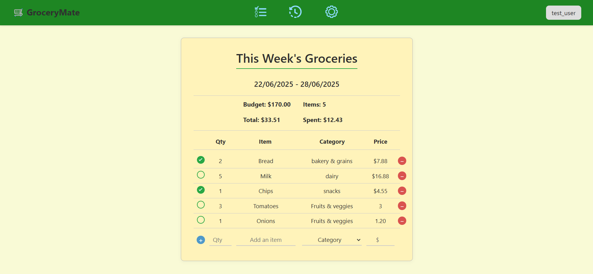
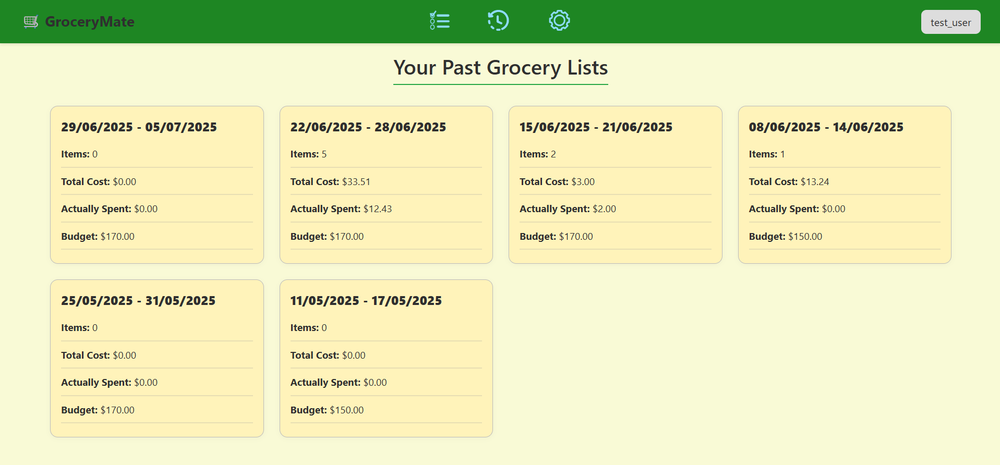

# GroceryMate

An easy to use web application to keep track of your grocery lists over the weeks. It allows you to create lists, check off items, and keep track of spending and budget.
[Go to website ->](https://grocerymate.onrender.com/login)

Note: this website uses Render free plan so it will take a couple minutes to load up initially.

## How to Use
Log in or register for an account. Passwords are encrypted into the database. If you want to test out the app, we have a testing account:

username: test_user

password: passwOrd12!

Set up your account in the settings app. You can change your budget for this week, and change the list of categories of your spendings.

Go to the My List tab to see this week's groceries. You can add, delete, and check off items of your list. This will update your list's summary at the top.

Go to the History tab to see all your grocery lists from your past week. It gives you a quick overview of each list, and you can click on each one to see the list in details.

## How It Was Made
This web app was originally made by Thuc Chi Do ([thucchi-cs](https://github.com/thucchi-cs))

This website was made with `Python`, `JavaScript`, `HTML`, and `CSS`. I used `Flask` to handle routing in this app. `psycopg2` was used to connect to my online `PostgreSQL` on `Neon`. This website is also deployed on `Render`.

### Made for Hack Club

  

